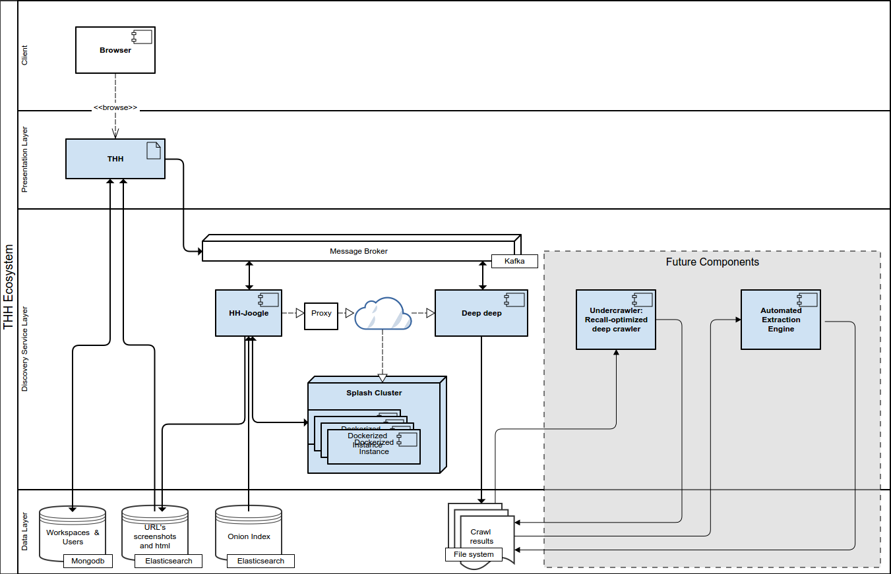

# Site Hound
Site Hound (previously THH) is a Domain Discovery Tool that extends the capabilities of commercial search engines using automation and human-in-the-loop (HITL) machine learning, allowing the user efficiently expand the set of relevant web pages within his domain/s or topic/s of interest. <br>
Site Hound is the UI to a more complex set of tools described below.
Site Hound was developed under the Memex Program by HyperionGray LLC in partnership with Scrapinghub, Ltd. (2015/2017)

### Main Features

 1. Role Based Access Control (RBAC).
 2. Multiple __workspaces__ for keeping things tidy.
 3. Input of __keywords__, to be included or excluded from searchs. 
 4. Input of __seeds URLs__, an initial list of websites that you already know are on-topic.
 5. Expand the list of sites by fetching the keywords on multiple commercial search engines.
 6. Displays __screenshots__ (powered by Splash), title, text, html, relevant terms in the text 
 7. Allows the user to __iteratively train__ a topic model based on these results by assigning them into defined values (Relevant/Irrelevant/Neutral), as well as re-scoring the associated keywords.
 8. Allows an unbounded training module based on __user-defined categories__.
 9. __Language detection__ (powered byApache Tika) and __page-type classification__ (powered by HG's [https://github.com/TeamHG-Memex/thh-classifiers](thh-classifier))
10. Allows the user to view the trained topic model through a human-interpretable explaination of the model powered by our machine learning explanation toolkit [https://github.com/TeamHG-Memex/eli5](ELI5)
11. Performs a __broad crawl__ of thousand of sites, using __Machine Learning__ (provided by [https://github.com/TeamHG-Memex/hh-deep-deep](DeepDeep-crawler)) filtering the ones matching the defined domain.
12. Displays the results in an interface similar to __Pinterest__ for easy scrolling of the findings.
13. Provides __summarized__ data about the broad crawl and __exporting__ of the broad-crawl results in CSV format.
14. Provides real time information about the __progress__ of the crawlers.
15. Allows search of the Dark web via integration with an __onion index__ 

   
    
### Infrastructure Components

When the app starts up, it will try to connect first with all this components    
- Mongo (>3.0.*) stores the data about users, workspace and metadata about the crawlings 
- Elasticsearch (2.0) stores the results of the crawling (screenshots, html, extracted text)
- Kafka (8.*) handles the communication between the backend components regarding the crawlings.

Custom Docker versions of these components are provided with their extra args to set up the stack correctly, in the Containers section below. 
    

### Service Components:

This components offer a suite of capabilities to Site Hound. Only the first three components are required.

- [Sitehound-Backend](https://github.com/TeamHG-Memex/sitehound-backend): Performs queries on the Search engines, follows the relevant links and orchestrates the screenshots, text extraction, 
language identification, page-classification, naive scoring using the cosine difference of TF*IDF, and stores the results sets.<br>
- [Splash](https://github.com/scrapinghub/splash): Splash is used for screenshoot and html capturing.
- [HH-DeepDeep](https://github.com/TeamHG-Memex/hh-deep-deep): Allows the user to train a page model to perform on-topic crawls
- [THH-classifier](https://github.com/TeamHG-Memex/thh-classifiers): Classifies pages according to their type (i.e. Forums, Blogs, etc)
- Dark Web index: This is currently a private db. Ask us about it.


Here is the components diagram for reference
 


### Containers
Containers are stored in [HyperionGray's docker hub](https://hub.docker.com/u/hyperiongray/dashboard/)


##### Mongodb
define a folder for the data
```bash
sudo mkdir -p /data/db
```
and run the container
```
docker run -d -p 127.0.0.1:27017:27017 --name=mongodb --hostname=mongodb -v /data/db:/data/db hyperiongray/mongodb:1.0
```

##### Kafka
```
docker run -d -p 127.0.0.1:9092:9092 -p 127.0.0.1:2181:2181 --name kafka-2.11-0.10.1.1-2.4 --hostname=hh-kafka hyperiongray/kafka-2.11-0.10.1.1:2.4
```
wait 10 secs for the service to fully start and be ready for connections
    

##### Elasticsearch
```
docker run -d -p 127.0.0.1:9200:9200 -p 127.0.0.1:9300:9300 --name=elasticsearch --hostname=elasticsearch elasticsearch:2.0
```

Lastly check [HH-DeepDeep](https://github.com/TeamHG-Memex/hh-deep-deep) installation notes about running it with Docker


### Configuration

Properties are defined in /ui/settings.py    


### Installation

The app runs on python 2.7 and the dependencies can be installed with pip
```bash
pip install -r requirements.txt
```
then start up the flask server
```
python runserver.py
```
The app should be listening on http://localhost:5081 with the admin credentials: admin@hyperiongray.com / changeme!


### Dockerized version of Sitehound

Alternatively, a container can be run instead of the local installation

```
sitehound_version="3.3.2"
docker run -d -p 0.0.0.0:5081:5081 --name=sitehound-$sitehound_version --hostname=sitehound --link mongodb:mongodb --link kafka-2.11-0.10.1.1-2.4:hh-kafka --link elasticsearch:hh-elasticsearch hyperiongray/sitehound:$sitehound_version
```
